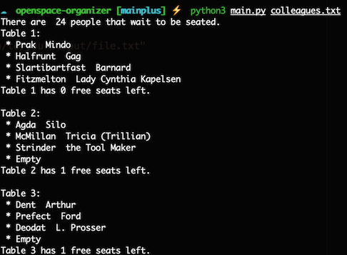

# Openspace organizer
Welcome to the Openspace Organizator!

<pre>
  __  ____  ____  __ _  ____  ____   __    ___  ____
 /  \(  _ \(  __)(  ( \/ ___)(  _ \ / _\  / __)(  __)
(  O )) __/ ) _) /    /\___ \ ) __//    \( (__  ) _)
 \__/(__)  (____)\_)__)(____/(__)  \_/\_/ \___)(____)
  __  ____   ___   __   __ _  __  ____   __  ____  __  ____
 /  \(  _ \ / __) / _\ (  ( \(  )(__  ) / _\(_  _)/  \(  _ \
(  O ))   /( (_ \/    \/    / )(  / _/ /    \ )( (  O ))   /
 \__/(__\_) \___/\_/\_/\_)__)(__)(____)\_/\_/(__) \__/(__\_)
 </pre>

 ascii from http://www.patorjk.com/software/taag/

This is the must-have version

## Description
The script randomly assigns people from a file to a seat in the open space. 

Your input file must have one person per line with the format 'firstname, name'

Organization is outputed in the terminal and svaed in org_colleagues.txt

## Installation
git clone git@github.com:audeha/BXL-Bouman-7.git 

cd openspace-organizer

## Usage
python3 main.py path/to/your/input/file.{txt|csv} 

You can use ./colleagues.txt --> python3 main.py ./colleagues.txt 

## Visuals

